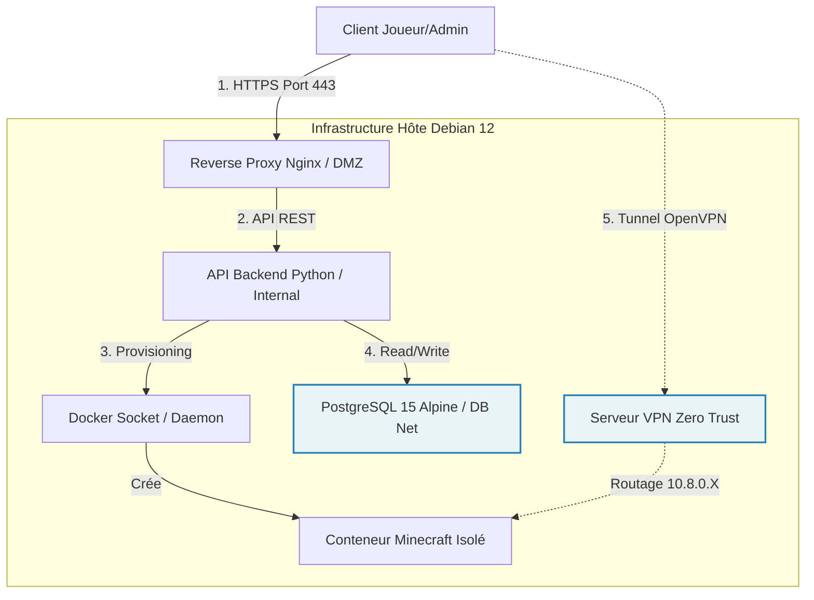

```markdown
# MineHost -- Plateforme d'Hébergement Minecraft Sécurisée (Zero Trust)

[](https://github.com)
[](https://github.com)
[](https://github.com)
[](https://www.docker.com)

MineHost est une plateforme SaaS self-hosted développée dans le cadre du Projet Fil Rouge (Bachelor Cybersécurité & Ethical Hacking -- EFREI 2025-2026). Ce projet de bout en bout permet le provisioning automatisé de serveurs Minecraft conteneurisés, strictement isolés et accessibles exclusivement via un tunnel VPN sécurisé.

---

## 1. Contexte et Conformité au Cahier des Charges

Le marché de l'hébergement de serveurs de jeux vidéo, et plus particulièrement Minecraft, est historiquement vulnérable. Les serveurs classiques exposent publiquement leurs adresses IP, ce qui les rend massivement sensibles aux attaques par déni de service distribué (DDoS) et aux scans de vulnérabilités automatisés. De plus, la mutualisation des ressources entraîne souvent des pertes de performances pour les clients finaux (phénomène du "noisy neighbor").

MineHost a été architecturé pour éradiquer ces vecteurs de compromission grâce à une approche Security by Design :
* Aucune exposition publique : Les serveurs de jeu ne disposent d'aucune IP routable sur Internet.
* Isolation absolue : Chaque locataire évolue dans un conteneur Docker dédié, utilisant des images spécifiques comme itzg/minecraft-server.
* Automatisation DevSecOps : Le cycle de vie complet de l'infrastructure est géré par du code (Terraform, Ansible), garantissant la reproductibilité et l'absence d'erreurs humaines.

---

## 2. Matrice de Compétences et Justifications Techniques

L'architecture de MineHost a été pensée pour valider intégralement les quatre grands critères d'évaluation de la grille académique.

### C1. Administration et Optimisation Système (OS)
* C1.1 Conformité de l'OS : Le socle d'hébergement repose sur un serveur Debian 12 durci. L'administration du système d'exploitation a été optimisée pour réduire la surface d'attaque. L'accès SSH est restreint (changement de port par défaut, authentification par clé cryptographique uniquement, et désactivation de l'accès root direct). Les interfaces réseau sont rigoureusement administrées, avec la configuration d'interfaces virtuelles comme tun0 pour le routage VPN.
* C1.2 Performance et QoS : L'efficacité opérationnelle est au cœur du système. Les tests réseau démontrent une latence extrêmement faible avec des temps de réponse moyens de 44 millisecondes observés lors des tests de ping ICMP sur la passerelle VPN (10.8.0.1). L'API backend, motorisée par minecraft-automation-api_server via l'exécution de python app.py, gère les requêtes d'orchestration de manière asynchrone, permettant un provisioning de serveur en quelques minutes seulement.

### C2. Topologies Systèmes et Contrôle d'Accès
* C2.2 Respect des politiques d'accès (ZTNA) : L'implémentation des contrôles d'accès est stricte et repose sur un modèle Zero Trust Network Access. Les utilisateurs doivent impérativement monter un tunnel OpenVPN pour entrer dans le réseau de confiance. Le trafic est chiffré via l'algorithme robuste AES-128-GCM. Une fois authentifié, le client se voit attribuer une adresse IP interne sécurisée, telle que 10.8.0.4, lui permettant de communiquer avec la passerelle 10.8.0.1.
* C2.3 Application du Moindre Privilège : La topologie réseau segmente les flux. Des sous-réseaux Docker dédiés ont été créés. Le trafic est ensuite redirigé en interne vers des ports dynamiques assignés, par exemple l'IP 10.8.0.2 sur le port 25967 pour une instance spécifique. Les politiques de pare-feu (iptables) assurent que seules les requêtes provenant du tunnel VPN peuvent atteindre les conteneurs de jeu.

### C3. Environnements Virtualisés et Rationalisation
* C3.1 Conformité de l'architecture virtualisée : Le choix de Docker Engine 24 permet une virtualisation légère et adaptée aux besoins de scalabilité. Chaque client possède un environnement virtualisé totalement étanche. Par exemple, le conteneur nommé mc-Test13354-1 opère de manière isolée.
* C3.2 Efficience et rationalisation des ressources : Les systèmes virtualisés sont gérés pour maximiser l'efficacité des ressources hôtes. Le mapping des ports est géré de manière rationnelle et dynamique par l'orchestrateur (ex: 0.0.0.0:25975->25565/tcp). De plus, l'interface permet d'allouer précisément la mémoire RAM selon les besoins, débutant à 512 MB pour les configurations "Petit - 2-5 joueurs", garantissant ainsi via les cgroups de Docker qu'un locataire ne saturera jamais la machine physique.

### C4. Gestion et Sécurisation des Bases de Données (SGBD)
* C4.1 Conformité du SGBD : La persistance des données relationnelles est assurée par PostgreSQL. Pour répondre aux exigences de sécurité, c'est l'image postgres:15-alpine qui a été sélectionnée. L'utilisation d'Alpine Linux réduit considérablement le poids du conteneur et limite drastiquement les bibliothèques disponibles, réduisant ainsi la surface de vulnérabilité.
* C4.2 Accessibilité sécurisée : Les mesures de protection du SGBD sont maximales. Le conteneur api-database écoute exclusivement sur le port 5432 au sein de son propre réseau Docker privé. Il est mathématiquement impossible d'y accéder depuis l'extérieur du serveur hôte ou depuis le réseau VPN des joueurs. Seul le conteneur de l'API (minecraft-api) y a accès pour valider les identifiants et l'état des serveurs.

---

## 3. Architecture Technique et Flux de Données

Le fonctionnement de la plateforme repose sur une orchestration de plusieurs couches logicielles.



---

## 4. Guide Opérationnel de Déploiement

Ce guide permet à un auditeur de reproduire l'infrastructure à l'identique.

### 4.1. Prérequis Système

* Serveur d'hébergement sous Debian 12.
* Ressources minimales : 4 vCPU, 8GB de RAM.
* Dépendances logicielles : Docker (>= 24), Docker Compose (>= 2.20), Terraform (>= 1.5), Ansible.

### 4.2. Initialisation et Provisioning

```bash
# 1. Récupération du code source et des scripts de déploiement
git clone [https://github.com/Maskass-z/minehost-terraform.git](https://github.com/Maskass-z/minehost-terraform.git)
cd minehost-terraform/src

# 2. Sécurisation des secrets via variables d'environnement
cp .env.example .env
nano .env

# 3. Déploiement de l'infrastructure de base (Réseaux, Volumes)
cd ../terraform
terraform init
terraform apply -auto-approve

# 4. Configuration applicative et Security as Code
cd ../ansible
ansible-playbook -i inventory.ini hardening_nginx.yml
ansible-playbook -i inventory.ini hardening_postgresql.yml

```

---

## 5. Cas d'Usage : Le Parcours Utilisateur

L'interface de MineHost a été pensée pour abstraire toute la complexité technique au client final. Voici le parcours standard :

1. Interface d'administration : Le client se connecte à son tableau de bord web.
2. Configuration du serveur : Il choisit le nom de son serveur (par exemple "Test", "serveur-pvp" ou "skyblock"). Il sélectionne ensuite la version du moteur de jeu, avec des options allant de la version 1.20.1 (Recommandée) à la version 1.21.
3. Déploiement asynchrone : L'orchestrateur prend le relais, télécharge les paquets nécessaires et monte les bibliothèques Java requises (comme jopt-simple et commons-lang).
4. Établissement du lien sécurisé : Le client télécharge la configuration OpenVPN. Une fois la séquence d'initialisation complétée avec succès sur sa machine (Initialization Sequence Completed), son interface réseau virtuelle est configurée avec l'IP 10.8.0.4.
5. Exploitation : Le client peut consulter les logs en temps réel via la console d'administration, envoyer des commandes RCON, et se connecter au jeu via l'IP et le port privés générés, par exemple 10.8.0.2:25967. Il dispose également d'actions rapides pour arrêter ou supprimer le serveur.

---

## 6. Supervision et Maintien en Condition Opérationnelle (MCO)

Pour l'administrateur de l'infrastructure, plusieurs outils sont disponibles pour garantir le fonctionnement optimal des services.

Accès distant sécurisé au serveur hôte :

```bash
ssh -p 2222 maskass@votre-serveur

```

Audit de la flotte de conteneurs :

```bash
# Vérification de l'état des services critiques (Up time, mappings)
docker ps

# Visualisation des performances CPU/RAM en direct pour prévenir la congestion
docker stats

# Traçabilité des actions de l'orchestrateur (erreurs, requêtes REST)
docker logs -f api

# Debugging applicatif d'un serveur client spécifique
docker logs -f mc-<id>-<user>

```

---

## 7. Informations Légales et Contributions

Projet académique réalisé dans le cadre du cursus Efrei Campus Bordeaux, promotion 2025-2026.

Membres de l'équipe d'ingénierie :

* Lead Developer & Architecte DevSecOps : Aydemir Alper
* Site Reliability Engineer (SRE) & FinOps : El Mensi Mehdi

Contact et assistance technique : support@minehost.com

```

```
