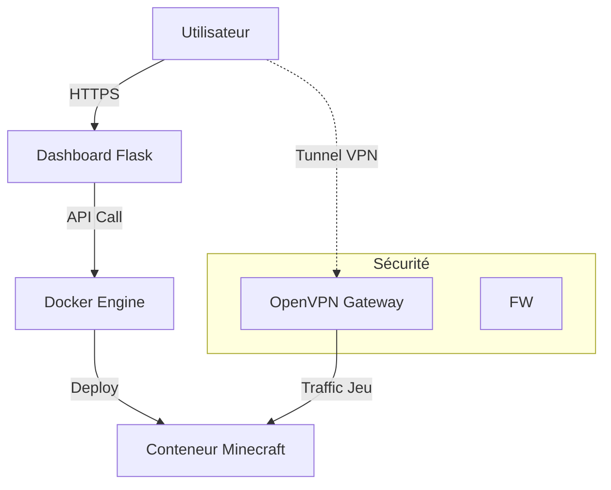

# MineHost — Plateforme d’Hébergement Minecraft Sécurisée

> **Projet Fil Rouge — Bachelor Cybersécurité & Ethical Hacking — EFREI 2025-2026**

**MineHost** est une plateforme SaaS *self-hosted* permettant la création automatisée de serveurs Minecraft isolés via Docker et accessibles uniquement via un réseau VPN Zero Trust.

---

## Objectif du projet

MineHost répond aux problématiques critiques des hébergeurs Minecraft classiques :
* ❌ Exposition Internet directe (risques d'attaques).
* ❌ Attaques DDoS fréquentes.
* ❌ Mauvaise isolation entre les utilisateurs.

La solution **MineHost** propose :
* ✅ **Accès VPN obligatoire** (Zero Trust).
* ✅ **Isolation Docker** stricte par utilisateur.
* ✅ **Provisioning automatisé** (Infrastructure as Code).

---

## Fonctionnalités principales

* **Dashboard Web** : Interface utilisateur intuitive.
* **Création Serveur** : Déploiement automatisé de conteneurs Minecraft.
* **Accès Sécurisé** : Génération automatique de configurations OpenVPN.
* **Gestion** : Logs en temps réel, Arrêt / Démarrage / Suppression.
* **Résilience** : Sauvegardes quotidiennes automatiques.

---

## Architecture Technique

**Stack Infrastructure :**
* **OS** : Debian 12 (Self-hosted)
* **Containerization** : Docker Engine
* **Backend** : API Python Flask
* **Database** : PostgreSQL
* **Sécurité** : OpenVPN

**Flux Applicatif :**
`Utilisateur` → `Dashboard` → `API` → `Docker` → `Serveur Minecraft isolé`

### Schéma d'Architecture



---

## Installation & Démarrage

### 1. Cloner le projet

```bash
git clone [https://github.com/](https://github.com/)<user>/minehost.git
cd minehost/src

```

### 2. Configurer l'environnement

```bash
cp .env.example .env
nano .env
# Renseignez les variables (DB_PASSWORD, VPN_CONFIG, etc.)

```

### 3. Démarrer la stack

```bash
docker compose up -d

```

### 4. Vérifier le déploiement

```bash
docker ps

```

---

## Démonstration Utilisateur

### Accès Dashboard

* **URL** : `http://localhost:5000`
* **Fonctionnalités** : Inscription, Connexion, Création de serveur.

### Workflow Type

1. **Connexion** au dashboard.
2. **Création** d'un serveur Minecraft (Choix RAM et Version).
3. **Provisioning** automatique (Durée : ~120 secondes).
4. **Téléchargement** du fichier de configuration VPN (`.ovpn`).
5. **Connexion** au serveur Minecraft via l'IP tunnel : `10.8.0.X:PORT`.

---

## Sécurité & Hardening

* **Network** : Aucune IP publique exposée pour les serveurs de jeu.
* **Firewall** : Règles `iptables` en `DROP` par défaut.
* **Containers** : Exécution en mode `non-root` (User namespace).
* **Access Control** : VPN obligatoire pour toute connexion au jeu.

---

## 🛠 Administration & Supervision

**Accès SSH Administrateur :**

```bash
ssh -p 2222 maskass@serveur

```

**Supervision des conteneurs :**

```bash
docker stats
docker logs -f api

```

---

## Scalabilité & Performance

**Machine actuelle :**

* 8 vCPU / 8GB RAM

**Capacité estimée :**

* 15 à 20 serveurs Minecraft simultanés (selon allocation RAM).

---

## Structure du dépôt

```text
.
├── src/                # Code source (API, Docker, Templates)
│   ├── api/            # Backend Flask
│   ├── templates/      # Frontend HTML/Jinja2
│   └── docker-compose.yaml
├── dat/                # Données persistantes (Volumes Docker)
├── backup/             # Scripts et archives de sauvegarde
├── cdc/                # Cahier des Charges & Documentation projet
└── amelioration/       # Pistes d'évolution (Roadmap)

```

---

## Équipe

**Projet Fil Rouge EFREI Bordeaux 2025-2026**

* **Lead Dev / DevSecOps** : Aydemir Alper
* **SRE / FinOps** : El Mensi Mehdi
---

# Minehost Terraform

Documentation et preuve : [preuve.pdf](https://github.com/Maskass-z/minehost-terraform/blob/main/src/Preuve.pdf)
